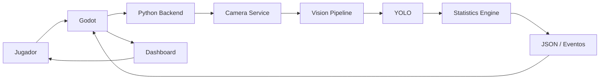
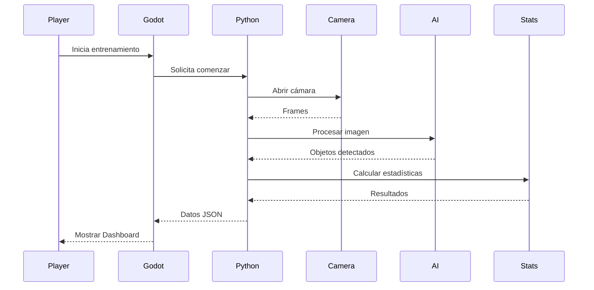
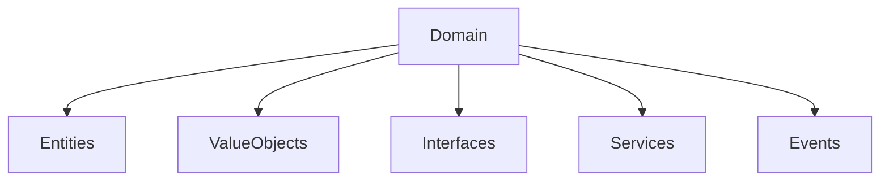
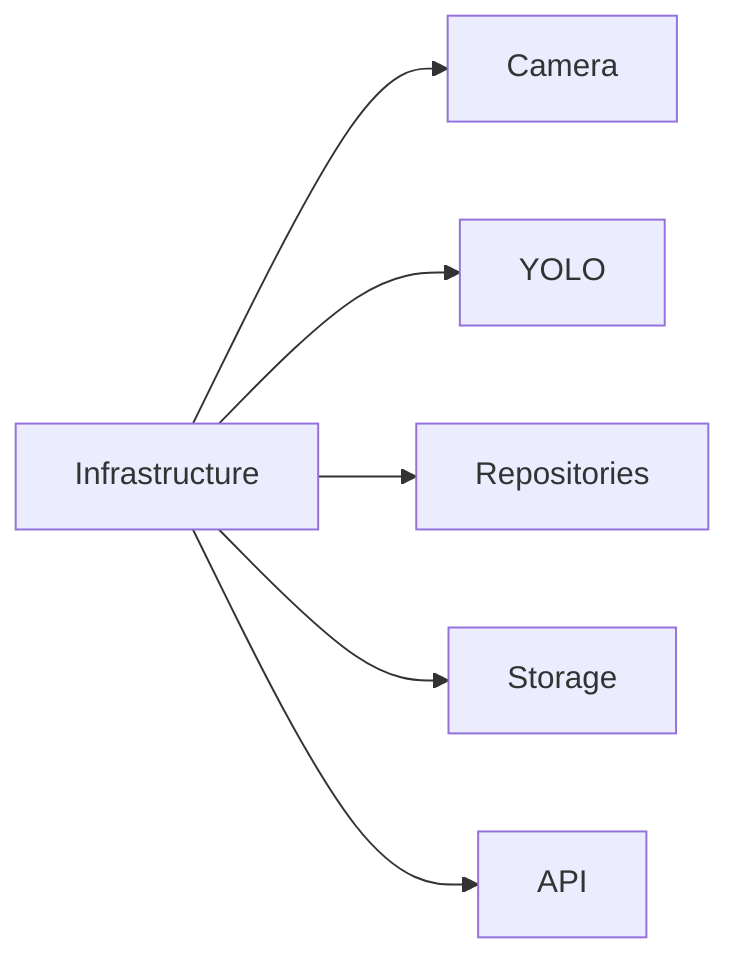
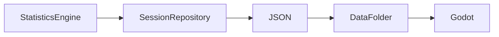
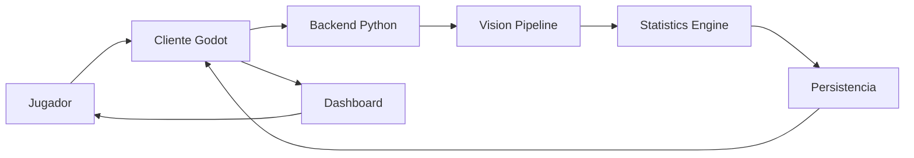
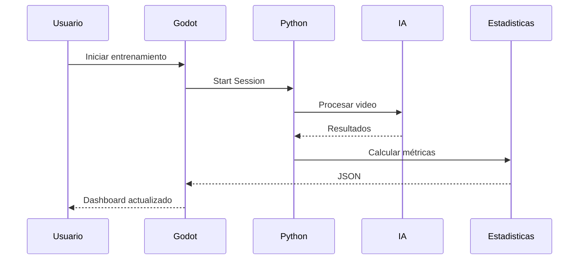
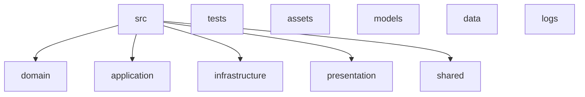

# PROJECT_ARCHITECTURE.md

# Arquitectura Oficial de VJC Hoops AI

**Versión:** 1.0

**Estado:** En desarrollo

**Última actualización:** Junio 2026

---

# Índice

1. Introducción
2. Filosofía de la Arquitectura
3. Arquitectura General del Sistema
4. Arquitectura Hexagonal
5. Comunicación Python ↔ Godot
6. Pipeline Completo de Inteligencia Artificial
7. Flujo de Datos
8. Organización del Código Fuente
9. Capa Domain
10. Capa Application
11. Capa Infrastructure
12. Capa Presentation (Godot)
13. Persistencia de Datos
14. APIs Internas
15. Optimización
16. Escalabilidad
17. Seguridad
18. Diagramas Técnicos
19. Arquitectura de Despliegue
20. Reglas Oficiales de Arquitectura

---

# 1. Introducción

## 1.1 Propósito del Documento

Este documento describe la arquitectura oficial de VJC Hoops AI.

Su objetivo es proporcionar una referencia técnica completa sobre la organización interna del software, las responsabilidades de cada módulo y la comunicación entre todos los componentes del sistema.

A diferencia de PROJECT_CONTEXT.md, que explica la visión y los objetivos generales del proyecto, este documento se centra exclusivamente en el diseño técnico y la arquitectura del software.

Todo desarrollador o Inteligencia Artificial que participe en el proyecto deberá comprender este documento antes de realizar modificaciones importantes.

---

## 1.2 Objetivos

La arquitectura del proyecto ha sido diseñada para cumplir los siguientes objetivos.

* Escalabilidad.
* Modularidad.
* Bajo acoplamiento.
* Alta cohesión.
* Reutilización de componentes.
* Facilidad de mantenimiento.
* Integración con Inteligencia Artificial.
* Compatibilidad multiplataforma.
* Preparación para futuras expansiones.

Cada decisión arquitectónica deberá contribuir a uno o varios de estos objetivos.

---

## 1.3 Alcance

Este documento cubre todos los componentes principales de VJC Hoops AI.

Incluye.

* Arquitectura general.
* Arquitectura Hexagonal.
* Flujo de datos.
* Organización de carpetas.
* Comunicación entre módulos.
* Comunicación entre Python y Godot.
* Persistencia.
* Pipeline de IA.
* Escalabilidad.
* Seguridad.
* Futuras ampliaciones.

No describe algoritmos específicos de visión por computadora ni detalles de implementación de modelos de Inteligencia Artificial.

Estos aspectos serán documentados en módulos independientes cuando sea necesario.

---

# 2. Filosofía de la Arquitectura

## 2.1 Principios Fundamentales

La arquitectura de VJC Hoops AI se basa en una filosofía de crecimiento a largo plazo.

El objetivo no consiste únicamente en desarrollar una aplicación funcional, sino construir una plataforma que pueda mantenerse y ampliarse durante muchos años.

Cada componente deberá diseñarse pensando en la reutilización, el mantenimiento y la facilidad para incorporar nuevas funcionalidades.

Las decisiones técnicas deberán priorizar siempre la claridad del diseño por encima de la rapidez de implementación.

---

## 2.2 Principios Arquitectónicos

Toda la arquitectura deberá respetar los siguientes principios.

* Separación de responsabilidades.
* Independencia tecnológica.
* Modularidad.
* Escalabilidad.
* Bajo acoplamiento.
* Alta cohesión.
* Código limpio.
* Documentación permanente.

Cada módulo tendrá una única responsabilidad claramente definida.

Los módulos deberán comunicarse mediante interfaces bien establecidas, evitando dependencias innecesarias.

---

## 2.3 Filosofía de Evolución

La arquitectura deberá permitir añadir nuevas funcionalidades sin modificar significativamente los módulos existentes.

Por ejemplo.

Actualmente.

* PersonDetector.
* ObjectTracker.

En futuras versiones podrán incorporarse.

* BallDetector.
* RimDetector.
* PoseEstimator.
* ShotDetector.
* StatisticsEngine.
* AI Coach.
* Cloud Sync.

La incorporación de estos módulos deberá requerir cambios mínimos en el resto del sistema.

---

# 3. Arquitectura General del Sistema

## 3.1 Visión General

VJC Hoops AI estará compuesto por dos grandes componentes.

1. Motor de Inteligencia Artificial desarrollado en Python.

2. Cliente gráfico desarrollado en Godot.

Ambos componentes serán independientes y se comunicarán mediante una interfaz claramente definida.

Esta separación permitirá actualizar uno de los sistemas sin afectar directamente al otro.

---

## 3.2 Componentes Principales

El sistema completo estará compuesto por los siguientes módulos.

* Cliente Godot.
* Motor de IA.
* Camera Service.
* Vision Pipeline.
* Object Tracker.
* Ball Detector.
* Rim Detector.
* Pose Estimation.
* Shot Detection.
* Statistics Engine.
* Sistema de Persistencia.
* Dashboard.
* Perfil del Jugador.
* Configuración.

Cada componente tendrá responsabilidades específicas y bien delimitadas.

---

## 3.3 Arquitectura de Alto Nivel

El flujo general del sistema será el siguiente.

```
Jugador

↓

Godot

↓

Python Backend

↓

Camera Service

↓

Vision Pipeline

↓

YOLO

↓

Tracking

↓

Shot Detection

↓

Statistics Engine

↓

JSON / Eventos

↓

Godot

↓

Dashboard

↓

Jugador
```

El usuario interactúa únicamente con Godot.

Todo el procesamiento de visión por computadora se ejecuta en Python.

Godot actúa como cliente de presentación y consume la información generada por el motor de Inteligencia Artificial.

---

## 3.4 Responsabilidades Globales

Python será responsable de.

* Captura de video.
* Inteligencia Artificial.
* Visión por computadora.
* Procesamiento.
* Estadísticas.
* Persistencia.
* Exportación.

Godot será responsable de.

* Interfaz.
* Animaciones.
* Menús.
* Dashboard.
* Editor de personajes.
* Configuración.
* Navegación.
* Experiencia de usuario.

Esta separación garantiza un sistema limpio y fácilmente mantenible.

---

# 4. Arquitectura Hexagonal

## 4.1 Introducción

VJC Hoops AI adoptará oficialmente la Arquitectura Hexagonal (Ports and Adapters) como base de todo el proyecto.

Este patrón permite aislar la lógica de negocio de las tecnologías utilizadas, facilitando el mantenimiento, las pruebas y la evolución del sistema.

La lógica principal nunca deberá depender directamente de bibliotecas externas como OpenCV, YOLO, Godot o sistemas de almacenamiento.

Todas las dependencias externas estarán encapsuladas en adaptadores específicos.

---

## 4.2 Objetivos de la Arquitectura Hexagonal

La adopción de esta arquitectura persigue los siguientes objetivos.

* Independencia tecnológica.
* Facilidad de pruebas.
* Sustitución de componentes sin afectar la lógica de negocio.
* Escalabilidad.
* Bajo acoplamiento.
* Mantenibilidad.

Gracias a esta organización será posible reemplazar una tecnología concreta sin necesidad de reescribir el resto del sistema.

Por ejemplo, en el futuro podría sustituirse YOLO por otro modelo de detección manteniendo intacta la lógica del dominio.

---


# 5. Comunicación entre Python y Godot

## 5.1 Introducción

La arquitectura de VJC Hoops AI estará dividida en dos sistemas principales completamente independientes.

El primero será el motor de Inteligencia Artificial desarrollado en Python.

El segundo será el cliente gráfico desarrollado utilizando Godot Engine.

Esta separación permite que ambos componentes evolucionen de manera independiente, facilitando el mantenimiento, las pruebas y la incorporación de nuevas funcionalidades sin afectar al resto del sistema.

Godot nunca ejecutará directamente los algoritmos de visión por computadora.

Python nunca será responsable de la interfaz gráfica.

Cada sistema tendrá responsabilidades claramente definidas.

---

## 5.2 Responsabilidad de Python

Python será el encargado de realizar todo el procesamiento relacionado con Inteligencia Artificial y visión por computadora.

Entre sus responsabilidades se incluyen.

* Capturar video desde la cámara.
* Procesar imágenes.
* Ejecutar modelos YOLO.
* Detectar personas.
* Detectar el balón.
* Detectar el aro.
* Realizar seguimiento de objetos.
* Detectar lanzamientos.
* Calcular estadísticas.
* Guardar sesiones.
* Exportar información.

Python será considerado el núcleo lógico del proyecto.

---

## 5.3 Responsabilidad de Godot

Godot será el cliente visual del sistema.

Su objetivo será mostrar la información generada por Python de forma clara, atractiva e interactiva.

Entre sus responsabilidades estarán.

* Pantalla de inicio.
* Menús.
* Dashboard.
* Editor de personajes.
* Configuración.
* Animaciones.
* Visualización de estadísticas.
* Sistema de logros.
* Navegación.
* Experiencia del usuario.

Godot nunca contendrá lógica de Inteligencia Artificial.

---

## 5.4 Flujo General de Comunicación

El flujo de información entre ambos componentes será el siguiente.



El usuario únicamente interactúa con Godot.

Python trabaja en segundo plano procesando toda la información.

---

## 5.5 Métodos de Comunicación

Inicialmente se evaluarán tres mecanismos de comunicación.

### Opción 1

Archivos JSON.

Ventajas.

* Muy sencillo.
* Fácil de depurar.
* Excelente para desarrollo inicial.

Desventajas.

* No funciona en tiempo real.

---

### Opción 2

Servidor HTTP Local.

Ventajas.

* Fácil integración.
* Muy flexible.
* Compatible con múltiples clientes.

Desventajas.

* Mayor complejidad.

---

### Opción 3

WebSockets.

Ventajas.

* Comunicación en tiempo real.
* Baja latencia.
* Ideal para estadísticas en vivo.

Desventajas.

* Implementación más compleja.

---

## 5.6 Estrategia Inicial

Durante las primeras versiones se utilizará una estrategia progresiva.

Fase 1.

JSON.

↓

Fase 2.

HTTP Local.

↓

Fase 3.

WebSockets.

Esta evolución permitirá desarrollar el proyecto sin añadir complejidad innecesaria desde el principio.

---

## 5.7 Datos Enviados por Python

Python enviará información estructurada a Godot.

Ejemplo.

* Número de tiros.
* Tiros acertados.
* Porcentaje.
* Posición del balón.
* Posición del aro.
* FPS.
* Estado del entrenamiento.
* Alertas.
* Eventos.

Toda la información viajará mediante estructuras claramente definidas.

---

## 5.8 Datos Recibidos por Python

Godot también enviará comandos al backend.

Ejemplos.

* Iniciar entrenamiento.
* Detener entrenamiento.
* Cambiar configuración.
* Seleccionar cámara.
* Reiniciar estadísticas.
* Cambiar perfil.
* Exportar resultados.

Python responderá únicamente a solicitudes válidas.

---

## 5.9 Diseño Desacoplado

Godot no conocerá la implementación interna de Python.

Python no conocerá la implementación interna de Godot.

Ambos sistemas se comunicarán mediante contratos bien definidos.

Esto permitirá sustituir cualquiera de los dos componentes sin afectar significativamente al otro.

---

## 5.10 Objetivo Final

La comunicación entre Python y Godot deberá ser rápida, estable, modular y fácilmente extensible.

La arquitectura permitirá incorporar nuevos módulos de Inteligencia Artificial sin modificar la interfaz gráfica y desarrollar nuevas interfaces sin alterar el motor de procesamiento.

Esta separación constituye uno de los principios fundamentales de la arquitectura de VJC Hoops AI.

---


# 6. Pipeline Completo de Inteligencia Artificial

## 6.1 Introducción

El Pipeline de Inteligencia Artificial representa el flujo completo de procesamiento de información dentro de VJC Hoops AI.

Cada imagen capturada por la cámara seguirá una secuencia de etapas bien definidas hasta convertirse en información útil para el jugador.

Cada módulo tendrá una responsabilidad específica y podrá evolucionar de manera independiente.

---

## 6.2 Objetivos del Pipeline

El pipeline deberá cumplir los siguientes objetivos.

* Procesamiento en tiempo real.
* Modularidad.
* Escalabilidad.
* Precisión.
* Baja latencia.
* Facilidad de mantenimiento.
* Independencia entre módulos.

---

## 6.3 Flujo General

```mermaid
flowchart LR

A[Cámara]

B[Camera Service]

C[Frame Manager]

D[Preprocesamiento]

E[YOLO Person Detector]

F[Object Tracker]

G[Ball Detector]

H[Rim Detector]

I[Pose Estimation]

J[Shot Detection]

K[Statistics Engine]

L[Persistencia]

M[Godot Dashboard]

A --> B
B --> C
C --> D
D --> E
E --> F
F --> G
G --> H
H --> I
I --> J
J --> K
K --> L
L --> M
```



Cada módulo recibe información del módulo anterior y entrega un resultado al siguiente.

---

## 6.4 Camera Service

El Camera Service será responsable de.

* Abrir la cámara.
* Configurar resolución.
* Configurar FPS.
* Obtener imágenes.
* Detectar errores.
* Liberar recursos.

Nunca contendrá lógica de IA.

---

## 6.5 Frame Manager

El Frame Manager organizará los cuadros capturados.

Funciones.

* Numeración de frames.
* Control temporal.
* Sincronización.
* Cola de procesamiento.

---

## 6.6 Preprocesamiento

Antes de ejecutar la IA se realizarán operaciones como.

* Cambio de tamaño.
* Conversión de color.
* Normalización.
* Eliminación de ruido.
* Optimización para inferencia.

Estas operaciones deberán ser lo más ligeras posible.

---

## 6.7 Detectores

Cada detector trabajará de forma independiente.

PersonDetector

↓

BallDetector

↓

RimDetector

↓

PoseEstimator

Cada uno podrá actualizarse sin modificar los demás.

---

## 6.8 Statistics Engine

El Statistics Engine recibirá únicamente información procesada.

Nunca analizará imágenes.

Su responsabilidad será transformar datos en métricas deportivas.

Ejemplos.

* Tiros.
* Aciertos.
* Porcentaje.
* Series.
* Historial.
* Promedios.

---

## 6.9 Persistencia

Una vez procesados los datos.

Se almacenarán.

* Sesión.
* Estadísticas.
* Perfil.
* Configuración.
* Logros.

---

## 6.10 Objetivo Final

El Pipeline deberá permitir incorporar nuevos módulos sin modificar significativamente el flujo existente.

Su diseño modular facilitará futuras expansiones del proyecto.

---

# 7. Flujo de Datos

## 7.1 Introducción

El flujo de datos describe cómo viaja la información desde la captura de la imagen hasta la visualización final en Godot.

Comprender este recorrido es fundamental para mantener una arquitectura organizada.

---

## 7.2 Flujo Principal



---

## 7.3 Información Generada

Durante una sesión se producirán distintos tipos de datos.

Datos visuales.

* Frames.
* Bounding Boxes.
* Keypoints.

Datos deportivos.

* Tiros.
* Aciertos.
* Errores.
* Porcentaje.

Datos técnicos.

* FPS.
* Tiempo de inferencia.
* Latencia.
* Uso de memoria.

---

## 7.4 Flujo de Eventos

El sistema utilizará eventos internos.

Ejemplos.

TrainingStarted

↓

ShotDetected

↓

BallReleased

↓

ShotScored

↓

StatisticsUpdated

↓

SessionFinished

Estos eventos permitirán desacoplar los módulos.

---

## 7.5 Comunicación Asíncrona

Siempre que sea posible.

Los módulos trabajarán mediante comunicación asíncrona.

Esto permitirá.

* Mejor rendimiento.
* Menor bloqueo.
* Mayor escalabilidad.

---

## 7.6 Validación

Cada módulo validará la información recibida antes de procesarla.

Nunca se asumirá que los datos son correctos.

---

## 7.7 Objetivo Final

El flujo de datos deberá mantenerse simple, claro y completamente documentado para facilitar futuras ampliaciones.

---

# 8. Organización del Código Fuente

## 8.1 Introducción

La estructura del proyecto ha sido diseñada para mantener una separación clara entre responsabilidades.

Cada carpeta tendrá un propósito específico.

Nunca deberán mezclarse módulos con funciones diferentes.

---

## 8.2 Estructura General

```text
src/

domain/

application/

infrastructure/

presentation/

shared/

tests/
```

Cada directorio representará una capa de la Arquitectura Hexagonal.

---

## 8.3 Domain

Contendrá únicamente reglas de negocio.

Ejemplos.

* Entidades.
* Objetos de valor.
* Interfaces.
* Servicios de dominio.

No dependerá de ninguna tecnología externa.

---

## 8.4 Application

Coordinará los casos de uso.

Ejemplos.

* Iniciar entrenamiento.
* Analizar sesión.
* Guardar resultados.
* Exportar estadísticas.

Será el puente entre el dominio y la infraestructura.

---

## 8.5 Infrastructure

Implementará los servicios externos.

Ejemplos.

* OpenCV.
* YOLO.
* Cámara.
* JSON.
* Base de datos.
* WebSockets.

Toda dependencia tecnológica estará concentrada aquí.

---

## 8.6 Presentation

Representará la interfaz gráfica.

Inicialmente estará implementada en Godot.

En el futuro podrán existir otros clientes.

* Web.
* Android.
* iOS.

---

## 8.7 Shared

Contendrá componentes reutilizables.

Ejemplos.

* Utilidades.
* Constantes.
* Configuración.
* Funciones comunes.

---

## 8.8 Tests

Toda funcionalidad importante deberá disponer de pruebas.

Ejemplos.

* Unit Tests.
* Integration Tests.
* Benchmarks.

Las pruebas deberán mantenerse separadas del código principal.

---

## 8.9 Objetivo Final

## La organización del código deberá facilitar la comprensión del proyecto, minimizar el acoplamiento y permitir que cualquier desarrollador o Inteligencia Artificial pueda localizar rápidamente cada componente dentro de la arquitectura.


# 9. Capa Domain (Dominio)

## 9.1 Introducción

La capa **Domain** representa el núcleo de VJC Hoops AI.

Aquí se implementarán las reglas de negocio del proyecto.

Esta capa no deberá conocer ninguna tecnología específica como OpenCV, YOLO, Godot, archivos JSON o bases de datos.

El dominio deberá poder ejecutarse incluso si mañana cambia completamente la tecnología utilizada.

---

## 9.2 Responsabilidades

La capa Domain será responsable de.

* Reglas de negocio.
* Entidades.
* Objetos de valor.
* Interfaces.
* Servicios de dominio.
* Validaciones.
* Eventos de dominio.

Nunca realizará operaciones de entrada o salida.

---

## 9.3 Componentes

Ejemplo.

```text
domain/

entities/

value_objects/

repositories/

services/

events/

exceptions/
```

---

## 9.4 Entidades

Algunas entidades previstas.

* Player
* TrainingSession
* Shot
* Statistics
* Character
* Achievement
* CameraConfiguration

Cada entidad representará un concepto real del sistema.

---

## 9.5 Objetos de Valor

Ejemplos.

* Position
* Velocity
* Angle
* Accuracy
* Score

Los Value Objects serán inmutables.

---

## 9.6 Interfaces

El dominio únicamente conocerá interfaces.

Ejemplo.

```text
ICamera

IPersonDetector

IBallDetector

IStatisticsRepository
```

Las implementaciones concretas estarán en Infrastructure.

---

## 9.7 Reglas

La capa Domain.

Puede conocer.

* Domain.

No puede conocer.

* Infrastructure.
* Godot.
* OpenCV.
* YOLO.
* JSON.
* Archivos.

---

## 9.8 Diagrama



---

# 10. Capa Application

## 10.1 Introducción

La capa Application coordina el funcionamiento del sistema.

No implementa reglas de negocio.

No implementa tecnologías externas.

Su objetivo es coordinar los casos de uso.

---

## 10.2 Responsabilidades

La capa Application será responsable de.

* Casos de uso.
* Coordinación.
* Flujo del sistema.
* Orquestación.
* Validación de procesos.

---

## 10.3 Casos de Uso

Ejemplos.

* StartTraining
* StopTraining
* AnalyzeShot
* SaveSession
* ExportStatistics
* UpdatePlayer
* CreateCharacter

Cada caso de uso deberá realizar una única tarea.

---

## 10.4 Organización

```text
application/

use_cases/

services/

dto/

commands/

queries/
```

---

## 10.5 Flujo

```mermaid
flowchart LR

Presentation

↓

Application

↓

Domain
```

La capa Application será el puente entre la interfaz y el dominio.

---

## 10.6 Dependencias

Application puede conocer.

* Domain.

Application no puede conocer directamente.

* OpenCV.
* YOLO.
* Godot.

---

# 11. Capa Infrastructure

## 11.1 Introducción

Infrastructure contiene todas las implementaciones tecnológicas.

Es la única capa que conoce las bibliotecas externas.

---

## 11.2 Componentes

Ejemplos.

```text
infrastructure/

camera/

vision/

tracking/

detectors/

repositories/

storage/

api/

websocket/

config/
```

---

## 11.3 Servicios

Ejemplos.

CameraService

FrameManager

PersonDetector

BallDetector

RimDetector

PoseEstimator

ShotDetector

StatisticsRepository

ExportService

---

## 11.4 Tecnologías

Infrastructure podrá utilizar.

* Python.
* OpenCV.
* YOLO.
* NumPy.
* JSON.
* WebSockets.
* FastAPI.
* SQLite (si se incorpora).
* Sistema de archivos.

---

## 11.5 Regla Principal

Infrastructure puede conocer.

Application

↓

Domain

Pero Domain nunca conocerá Infrastructure.

---

## 11.6 Diagrama



---

# 12. Capa Presentation (Godot)

## 12.1 Introducción

Presentation representa la interfaz visible para el usuario.

Inicialmente será implementada utilizando Godot Engine.

Toda interacción del usuario comenzará aquí.

---

## 12.2 Responsabilidades

Presentation será responsable de.

* Pantalla de inicio.
* Navegación.
* Dashboard.
* HUD.
* Configuración.
* Editor de personajes.
* Animaciones.
* Sonidos.
* Accesibilidad.

Nunca ejecutará modelos de IA.

---

## 12.3 Organización

```text
presentation/

scenes/

ui/

hud/

dashboard/

character_editor/

menus/

assets/
```

---

## 12.4 Escenas Principales

Escenas previstas.

MainMenu

Login

Lobby

Training

Statistics

Profile

Settings

CharacterEditor

Credits

---

## 12.5 Flujo General

```mermaid
flowchart TD

Jugador

↓

Godot

↓

Application

↓

Infrastructure

↓

Domain

↓

Resultado

↓

Godot

↓

Jugador
```

La interfaz nunca accederá directamente a OpenCV o a los modelos de IA.

Toda comunicación deberá pasar por la arquitectura definida.

---

## 12.6 Reglas de la Interfaz

La capa Presentation deberá cumplir los siguientes principios.

* Separación entre lógica y presentación.
* Componentes reutilizables.
* Navegación desacoplada.
* Interfaces responsivas.
* Accesibilidad.
* Internacionalización.
* Preparación para futuras plataformas.

---

## 12.7 Objetivo Final

Las cuatro capas de la Arquitectura Hexagonal constituyen el núcleo técnico de VJC Hoops AI.

Esta organización permitirá mantener una separación clara entre la lógica del negocio, los casos de uso, las tecnologías externas y la interfaz de usuario.

Gracias a esta arquitectura, el proyecto podrá crecer durante muchos años incorporando nuevos módulos sin comprometer la estabilidad ni la mantenibilidad del sistema.


# 13. Persistencia de Datos

## 13.1 Introducción

La persistencia de datos es el mecanismo encargado de almacenar toda la información generada durante el uso de VJC Hoops AI.

El sistema deberá permitir guardar el progreso del jugador, las estadísticas de entrenamiento, la configuración personalizada, los perfiles, los personajes y cualquier otro dato necesario para garantizar la continuidad de la experiencia.

La arquitectura deberá permitir cambiar el mecanismo de almacenamiento sin afectar el resto del sistema.

---

## 13.2 Objetivos

La persistencia deberá cumplir los siguientes objetivos.

* Almacenamiento seguro.
* Recuperación rápida.
* Independencia tecnológica.
* Facilidad de respaldo.
* Escalabilidad.
* Compatibilidad multiplataforma.

---

## 13.3 Estructura General

```text
data/

players/

sessions/

statistics/

characters/

settings/

backups/

logs/
```

Cada directorio almacenará únicamente información relacionada con su responsabilidad.

---

## 13.4 Flujo de Persistencia



---

## 13.5 Repositorios

Todos los accesos a datos deberán realizarse mediante repositorios.

Ejemplos.

* PlayerRepository
* SessionRepository
* StatisticsRepository
* CharacterRepository
* SettingsRepository

El resto del sistema nunca accederá directamente a archivos JSON.

---

## 13.6 Versionado de Datos

Cada archivo persistente incluirá un número de versión.

Ejemplo.

```json
{
    "version": "1.0.0"
}
```

Esto permitirá migrar información cuando cambie el formato interno.

---

## 13.7 Futuras Expansiones

La arquitectura permitirá sustituir los archivos JSON por otros sistemas.

Ejemplos.

* SQLite.
* PostgreSQL.
* Firebase.
* MongoDB.
* API Cloud.

Sin modificar la lógica del dominio.

---

# 14. APIs Internas y Comunicación

## 14.1 Introducción

Los distintos módulos de VJC Hoops AI deberán comunicarse mediante interfaces claramente definidas.

La comunicación nunca deberá depender de implementaciones concretas.

---

## 14.2 Tipos de Comunicación

Inicialmente existirán tres mecanismos.

* Comunicación interna mediante interfaces.
* Comunicación entre procesos mediante JSON.
* Comunicación en tiempo real mediante WebSockets (futuro).

---

## 14.3 API Interna

Ejemplo simplificado.

```text
Godot

↓

TrainingController

↓

StartTrainingUseCase

↓

CameraService

↓

VisionPipeline

↓

StatisticsEngine

↓

SessionRepository
```

Cada módulo únicamente conocerá al inmediatamente inferior.

---

## 14.4 Contratos

Toda comunicación deberá realizarse mediante contratos.

Ejemplos.

* ICamera
* IDetector
* IRepository
* IExporter

Nunca deberán utilizarse implementaciones concretas fuera de Infrastructure.

---

## 14.5 DTO (Data Transfer Objects)

La comunicación entre capas utilizará DTO.

Ejemplos.

TrainingRequestDTO

TrainingResultDTO

StatisticsDTO

ShotDTO

PlayerDTO

Los DTO evitarán exponer directamente las entidades del dominio.

---

## 14.6 Eventos

El sistema utilizará eventos para desacoplar componentes.

Ejemplos.

TrainingStarted

FrameCaptured

PersonDetected

BallDetected

ShotDetected

StatisticsUpdated

TrainingFinished

Cada evento podrá ser escuchado por distintos módulos sin generar dependencias innecesarias.

---

## 14.7 Objetivo Final

Toda la comunicación del sistema deberá ser predecible, documentada y fácilmente ampliable.

---

# 15. Rendimiento y Optimización

## 15.1 Introducción

VJC Hoops AI ha sido diseñado para funcionar en tiempo real.

El rendimiento será un requisito fundamental desde las primeras versiones del proyecto.

---

## 15.2 Objetivos

El sistema buscará mantener.

* Baja latencia.
* Alta tasa de FPS.
* Consumo moderado de memoria.
* Uso eficiente de CPU.
* Aprovechamiento de GPU cuando exista.

---

## 15.3 Estrategias

Las principales estrategias de optimización serán.

* Procesamiento por módulos.
* Evitar cálculos duplicados.
* Caché cuando sea necesario.
* Reutilización de objetos.
* Procesamiento asíncrono.
* Carga diferida de recursos.

---

## 15.4 Pipeline Optimizado

```mermaid
flowchart LR

Camera

↓

FrameQueue

↓

YOLO

↓

Tracker

↓

Statistics

↓

Dashboard
```

Cada módulo deberá procesar únicamente la información necesaria.

---

## 15.5 Optimización de IA

Los modelos deberán poder reemplazarse por versiones más ligeras cuando sea necesario.

Ejemplos.

YOLOv8n

↓

YOLOv8s

↓

YOLOv8m

↓

Modelos personalizados

La arquitectura deberá facilitar estas sustituciones.

---

## 15.6 Medición

Durante el desarrollo se registrarán métricas como.

* FPS.
* Tiempo de inferencia.
* Uso de CPU.
* Uso de GPU.
* Consumo de memoria.
* Latencia total.

Estas métricas servirán para validar cada Sprint.

---

# 16. Escalabilidad

## 16.1 Introducción

Toda la arquitectura ha sido diseñada pensando en el crecimiento continuo del proyecto.

Cada nuevo módulo deberá poder añadirse sin modificar significativamente los existentes.

---

## 16.2 Escalabilidad Horizontal

La arquitectura permitirá incorporar nuevos detectores.

Ejemplo.

PersonDetector

↓

BallDetector

↓

RimDetector

↓

PoseEstimator

↓

FutureGestureDetector

↓

FutureCoachAI

Cada componente será independiente.

---

## 16.3 Escalabilidad Vertical

También será posible ampliar funcionalidades existentes.

Ejemplos.

StatisticsEngine

↓

AdvancedStatisticsEngine

↓

PredictiveStatisticsEngine

↓

AI Coach Engine

Sin romper la compatibilidad.

---

## 16.4 Expansión Multiplataforma

El backend permanecerá independiente del cliente gráfico.

Esto permitirá crear clientes para.

* Godot.
* Android.
* iOS.
* Web.
* Escritorio.

Todos reutilizando el mismo motor de IA.

---

## 16.5 Modularidad

Cada nuevo componente deberá añadirse como un módulo independiente.

Nunca deberán modificarse componentes existentes únicamente para incorporar nuevas funcionalidades.

---

## 16.6 Objetivo Final

La arquitectura de VJC Hoops AI deberá ser capaz de evolucionar durante muchos años sin perder claridad, mantenibilidad ni rendimiento.

Cada decisión técnica deberá favorecer el crecimiento sostenible del proyecto y facilitar la incorporación de nuevas tecnologías, nuevos deportes y nuevas plataformas.


# 17. Seguridad, Gestión de Errores y Recuperación del Sistema

## 17.1 Introducción

La arquitectura de VJC Hoops AI deberá diseñarse considerando la estabilidad y la confiabilidad como requisitos fundamentales.

Todo componente deberá ser capaz de detectar errores, registrarlos adecuadamente y recuperarse cuando sea posible sin comprometer la experiencia del usuario.

La gestión de errores no deberá limitarse a mostrar mensajes en pantalla, sino que formará parte de la arquitectura general del sistema.

---

## 17.2 Principios de Seguridad

El proyecto seguirá los siguientes principios.

* Validar toda entrada del usuario.
* No almacenar información sensible en texto plano.
* No incluir claves API dentro del repositorio.
* Utilizar `.gitignore` correctamente.
* Mantener separados el código y los datos del usuario.
* Registrar errores críticos.
* Evitar operaciones destructivas sin confirmación.

---

## 17.3 Manejo de Errores

Todos los módulos deberán implementar un manejo adecuado de excepciones.

Ejemplos.

* Cámara no disponible.
* Modelo de IA inexistente.
* Error al cargar configuración.
* Archivo JSON corrupto.
* Error de comunicación entre Python y Godot.
* Falta de permisos de escritura.

Cada error deberá generar un registro en los archivos de log y, cuando corresponda, un mensaje comprensible para el usuario.

---

## 17.4 Recuperación

Siempre que sea posible el sistema deberá recuperarse automáticamente.

Ejemplos.

* Reintentar abrir la cámara.
* Recargar configuraciones.
* Restaurar la última sesión válida.
* Regenerar archivos temporales.

La recuperación automática deberá priorizar la continuidad de la sesión.

---

## 17.5 Logging

Todos los eventos importantes deberán registrarse.

Ejemplos.

* Inicio del sistema.
* Carga de modelos.
* Inicio de entrenamiento.
* Finalización de entrenamiento.
* Errores.
* Advertencias.
* Información de depuración.

Los logs facilitarán el mantenimiento y el análisis de incidencias.

---

# 18. Diagramas Técnicos de la Arquitectura

## 18.1 Arquitectura General



---

## 18.2 Arquitectura Hexagonal

```mermaid
flowchart TD

Presentation

↓

Application

↓

Domain

Infrastructure --> Application

Infrastructure --> Domain
```

---

## 18.3 Flujo de una Sesión



---

## 18.4 Pipeline de Visión

```mermaid
flowchart LR

Camera

↓

FrameManager

↓

Preprocessing

↓

PersonDetector

↓

ObjectTracker

↓

BallDetector

↓

RimDetector

↓

PoseEstimator

↓

ShotDetector

↓

StatisticsEngine
```

---

## 18.5 Organización General



---

## 18.6 Objetivo

Estos diagramas representan una visión simplificada de la arquitectura.

Deberán mantenerse sincronizados con la evolución real del proyecto y actualizarse cuando cambie el diseño del sistema.

---

# 19. Arquitectura de Despliegue

## 19.1 Objetivo

La arquitectura de despliegue define cómo se distribuirán y ejecutarán todos los componentes del proyecto.

La separación entre backend, cliente gráfico y recursos facilitará futuras actualizaciones.

---

## 19.2 Componentes

El sistema estará compuesto por.

* Cliente Godot.
* Backend Python.
* Modelos de IA.
* Archivos de configuración.
* Datos del usuario.
* Recursos gráficos.
* Documentación.

Cada componente podrá evolucionar de forma independiente.

---

## 19.3 Estructura de Despliegue

```text
VJC-Hoops-AI/

README.md
README_EN.md
PROJECT_CONTEXT.md
PROJECT_ARCHITECTURE.md
ROADMAP.md
CHANGELOG.md

src/
assets/
models/
config/
data/
logs/
tests/
docs/
```

---

## 19.4 Requisitos Iniciales

El sistema deberá ejecutarse inicialmente en Windows.

Posteriormente se añadirá compatibilidad oficial con.

* Linux.
* macOS.

En futuras versiones también se evaluará el soporte para Android e iOS.

---

## 19.5 Dependencias

Tecnologías principales.

* Python.
* Godot.
* OpenCV.
* Ultralytics YOLO.
* NumPy.
* FastAPI (futuro).
* WebSockets (futuro).

Cada dependencia deberá documentarse en el README.

---

## 19.6 Despliegue Futuro

La arquitectura permitirá incorporar.

* Instalador automático.
* Actualizador.
* Sincronización en la nube.
* Descarga automática de modelos.
* Gestión de versiones.

Sin modificar la lógica del sistema.

---

# 20. Reglas Oficiales de Arquitectura

## 20.1 Propósito

Las siguientes reglas son obligatorias para cualquier desarrollador o Inteligencia Artificial que participe en VJC Hoops AI.

Su objetivo es mantener una arquitectura consistente durante todo el ciclo de vida del proyecto.

---

## 20.2 Reglas Fundamentales

Toda modificación deberá respetar la Arquitectura Hexagonal.

Nunca deberán mezclarse responsabilidades entre capas.

Todo nuevo módulo deberá estar documentado.

Toda funcionalidad importante deberá incluir pruebas.

Las dependencias externas deberán aislarse en Infrastructure.

La lógica de negocio nunca dependerá de tecnologías específicas.

---

## 20.3 Convenciones

Se utilizarán las siguientes convenciones.

* Archivos Python: `snake_case`
* Clases: `PascalCase`
* Funciones: `snake_case`
* Constantes: `UPPER_CASE`

Toda nueva carpeta deberá seguir la estructura oficial del proyecto.

---

## 20.4 Evolución

La arquitectura está diseñada para crecer durante muchos años.

Toda nueva funcionalidad deberá incorporarse mediante nuevos módulos en lugar de modificar componentes existentes cuando sea posible.

La prioridad será mantener la estabilidad del sistema.

---

## 20.5 Documentación

Cualquier cambio arquitectónico deberá reflejarse inmediatamente en.

* README.md
* PROJECT_CONTEXT.md
* PROJECT_ARCHITECTURE.md
* ROADMAP.md
* CHANGELOG.md

La documentación oficial será siempre la fuente principal de información del proyecto.

---

## 20.6 Declaración Final

PROJECT_ARCHITECTURE.md constituye la especificación técnica oficial de VJC Hoops AI.

Toda decisión relacionada con el diseño interno del sistema deberá respetar los principios definidos en este documento.

La combinación de una Arquitectura Hexagonal, una separación clara entre Python y Godot, una documentación completa y una planificación estructurada permitirá construir una plataforma moderna, escalable y preparada para evolucionar durante muchos años.

Este documento deberá mantenerse actualizado conforme avance el desarrollo del proyecto y servirá como referencia técnica para cualquier desarrollador o Inteligencia Artificial que participe en la evolución de VJC Hoops AI.

---
